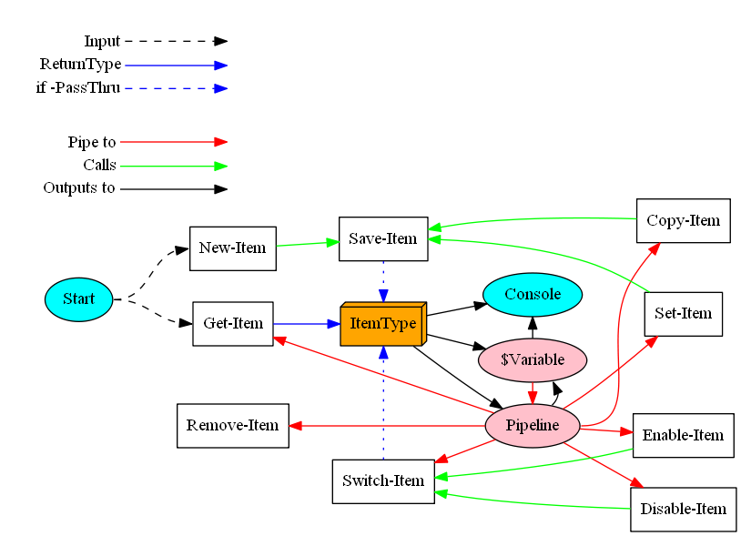

# OPNsense Items

The cmdlets below interact with OPNsense Items using PowerShell.
OPNsense Items are represented in the webGUI as a table of rows that can be clicked to edit their properties.
In PowerShell these are represented as OPNsense.Item.* *objects* which share common cmdlets to create, get, set and remove all OPNsense items.

## Item Flow

Examples of OPNsense Items are: CronJobs, CaptivePortal Templates and Zones, ...

----------
## Working with OPNsense Items

Two cmdlets are used to get an OPNsense item:
- Get-OPNsenseItem : Retrieves existing items
- New-OPNsenseItem : Creates a new item

Once you have an OPNsenseItem you can either:
- Output the item to the console
- Store it in a variable
- Pass it along the pipeline

### Get-OPNsenseItem

Simply specify the OPNsense ModuleName (eg plugin) and ObjectName to retrieve the items.

### New-OPNsenseItem

Specify the OPNsense ModuleName (eg plugin) and ObjectName to retrieve an empty OPNsense Item.

----------
## Changing Items

### Set-OPNsenseItem

Use this cmdlet to change the paramters of an OPNsense item.

There will be no output if the cmdlet succeeds unless you specify the -PassThru parameter.
Using -PassThru will return the item in its changed state.

### Item State

These three cmdlets can be used to quickly enable or disable the state of an OPNsense Item:
- Enable-OPNsenseItem : Set the enabled property to $True
- Disable-OPNsenseItem : Set the enabled property to $False
- Switch-OPNsenseItem : Toggle between the enabled states

There will be no output if the cmdlet succeeds unless you specify the -PassThru parameter.
Using -PassThru will return the item in its changed state.

*Note:* These cmdlets are shorthand equivalents for Set-OPNsenseItem -Enabled $state

----------
## Cloning Items

### Copy-OPNsenseItem

Given an OPNsense item, you can make a clone of it by passing it to the Copy-OPNsenseItem cmdlet.

There will be no output if the cmdlet succeeds unless you specify the -PassThru parameter.
Using -PassThru will return the new item.

----------
## Removing Items
### Remove-OPNsenseItem

Pass an item to this cmdlet to delete it in OPNsense.
It will request confirmation, unless you set the -Confirm:$false switch parameter.

There will be no output if the cmdlet succeeds unless you specify the -PassThru parameter.
When specifying -PassThru it will return the UUIDs of the deleted items for reference.